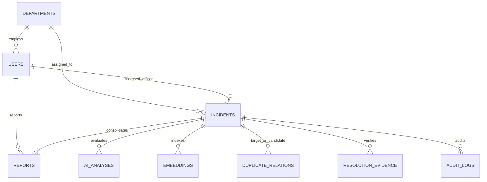

# CivicShield AI — Comprehensive Platform Analysis
**Problem & Solution Thesis, System Architecture, Algorithmic Engines, and Technical Blueprint**

---

## Executive Summary

Municipal administrations and urban local bodies worldwide struggle with an overwhelming volume of citizen complaints. Existing grievance portals operate as passive digital filing cabinets: they ingest unformatted reports, queue them on an arbitrary First-In-First-Out (FIFO) basis, route them through fragmented bureaucratic silos, and close them without verifiable proof. Consequently, dangerous hazards (such as open manholes or live electrical cables near schools) sit unaddressed behind cosmetic complaints, multiple citizens submit redundant tickets for the exact same pothole using different words, and public trust continuously declines.

**CivicShield AI** is an intelligent civic issue detection, prioritization, and resolution platform designed to solve this crisis. Instead of treating citizen reports as isolated, text-only tickets, CivicShield AI operates as an **issue transformation and intelligence pipeline**:
1. **Multi-Modal Intake**: Ingests citizen reports across voice, camera imagery, structured text, and Leaflet GPS geolocation.
2. **AI Vision & Understanding**: Uses Google Gemini 2.5 Flash to automatically detect damage category, extract severity indicators, and determine safety risks.
3. **Dual-Signal Deduplication & Clustering**: Combines 768-dimensional semantic embeddings (`text-embedding-004` via `pgvector`) with Haversine spatial proximity algorithms to consolidate duplicate neighborhood reports into single "Master Incidents", boosting priority score as community reports accumulate.
4. **Transparent 5-Factor Priority Scoring**: Calculates a weighted, explainable priority score ($0\text{--}100$) balancing Safety Risk (35%), Physical Severity (25%), Public Impact (20%), Recurrence (10%), and Location Sensitivity (10%).
5. **Civic Operations Command Center**: Provides municipal leadership with real-time operational feeds, an automated Action Queue (emergencies, unassigned high-priority cases, SLA breaches), department workload pressure indicators, and civic hotspot analytics.
6. **Multi-Stage Closed-Loop Verification**: Field workers upload photographic proof of repair via a dedicated Worker App; Authorities review and approve this evidence; finally, citizens hold private UUID tracking keys to inspect the proof and either confirm resolution or reject and reopen the work order.

---

## PART I: PROBLEM & SOLUTION PERSPECTIVE

### 1. The Core Real-World Problem

#### 1.1 The Breakdown of Municipal Grievance Redressal
Traditional municipal grievance portals (e.g., CPGRAMS, municipal webforms, general citizen apps) suffer from systemic structural failures:

| Pain Point | Root Cause | Real-World Impact |
| :--- | :--- | :--- |
| **Complaint Duplication & Noise** | When a major water pipe bursts or a main road collapses, dozens of citizens report the incident using different words, from slightly different angles or addresses. | Municipal officers are buried under hundreds of duplicate tickets, diluting response time and masking the true scale of the emergency. |
| **The FIFO Triage Trap** | Complaints are queued strictly in order of arrival (First-In, First-Out) or sorted by subjective user selection. | A cosmetic complaint (e.g., faint graffiti) filed at 9:00 AM gets reviewed before an open high-voltage cable or manhole outside a school filed at 9:15 AM. |
| **Department Siloing & Misrouting** | Citizens do not know which municipal department handles an issue (e.g., stormwater drainage vs. sewage vs. road repair). | Complaints spend days or weeks being manually reassigned and rejected across departments while the physical damage worsens. |
| **The "Closed Ticket" Illusion** | Departments are judged on ticket closure metrics, incentivizing administrative closure without physical repair. | Citizens receive automated SMS notifications stating *"Your issue has been resolved"* while the physical pothole remains untouched, completely eroding civic trust. |
| **Zero Civic Memory & Repeat Failures** | Municipal systems treat every complaint as an isolated snapshot in time without geographic or historical context. | Potholes patched with substandard materials wash away every monsoon at the exact same coordinates, yet each recurrence is treated as a brand-new complaint. |
| **Information Asymmetry** | Citizens have no visibility into the lifecycle of their complaint beyond vague statuses. | Frustrated citizens repeatedly submit duplicate complaints across multiple channels, further clogging municipal systems. |

#### 1.2 The Failure of Naive Social Media Scraping
Earlier concepts in civic tech often proposed "scraping X/Twitter and WhatsApp for civic complaints." However, in-depth research proved that uncurated social listening fails in real-world governance due to:
* **API rate limits and exorbitant pricing** (e.g., enterprise tier API restrictions).
* **High signal-to-noise ratio** (rage bait, political arguments, satire, outdated photos).
* **Missing critical spatial metadata** (social media posts rarely contain verified GPS coordinates or exact street addresses).
* **Lack of citizen accountability** and inability to conduct two-way closed-loop verification.

---

### 2. The CivicShield AI Solution

CivicShield AI pivoted from unviable social media scraping to an **Agentic Citizen Report Fusion & Verification Architecture**:

```
CITIZEN INTERACTION
  [Voice Dictation] ─┐
  [Camera / Photo]   ├─► 4-Step Intuitive Intake ──► Unique UUID Tracking Code
  [Map Pinning]      │   (Anonymous or Profile)
  [Text Description] ─┘
                                 │
                                 ▼
INTELLIGENT TRANSFORMATION
  ├── Multi-Modal AI Vision & Classification (Google Gemini 2.5 Flash)
  ├── 768d Vector Embeddings (Google text-embedding-004)
  ├── Spatial Proximity Calculation (Haversine Formula within 250m)
  ├── Dual-Signal Auto-Clustering & Human-in-the-Loop Deduplication
  └── Explainable 5-Factor Priority Engine (0-100 Score + Human Rationale)
                                 │
                                 ▼
MUNICIPAL OPERATIONS & ACTION
  ├── Civic Operations Command Center (Real-Time Action Queue)
  ├── Automated Department Routing & Dispatch (Roads, Drainage, Electrical, etc.)
  ├── SLA Monitoring & Emergency Escalation Triggers
  └── Geographic Hotspot & Recurrence Analytics
                                 │
                                 ▼
CLOSED-LOOP VERIFICATION
  ├── Field Worker Uploads Photographic Proof of Repair via Worker App
  ├── Authority Officer Approves Evidence (Transitions to CITIZEN_VERIFICATION)
  └── Citizen Inspects Photo via Private Tracker ──► [CONFIRM RESOLUTION] or [REOPEN WORK ORDER]
```

#### 2.1 Key Solution Pillars

1. **Intelligent Issue Transformation**: Converts messy, multi-modal human input into a strictly structured municipal work order complete with verified damage classification, estimated severity, and suggested department assignment.
2. **Dual-Signal Duplicate Detection & Consolidation**: Uses cosine vector distance on semantic embeddings combined with Haversine geographic distance. Rather than cluttering the database with 50 separate tickets, neighborhood reports are merged into a single Master Incident, and each additional confirmation elevates the incident's priority score.
3. **Explainable Priority Algorithm**: A transparent, weighted formula calculates an exact score between 0 and 100 with clear written rationale, ensuring high-risk civic hazards are triaged first without algorithmic bias.
4. **Accountability via Multi-Stage Verification**: Work orders cannot simply be marked "Resolved". Field workers must upload photographic proof of repair. This proof is first vetted by the Municipal Authority. Once approved, the citizen who reported the issue holds the final say: they review the repair photo and either verify completion or reopen the case.
5. **Civic Memory & Systemic Intelligence**: By aggregating historical incidents within spatial buffers, the platform detects chronic infrastructure hotspots, predicts SLA breaches, and surfaces root-cause hypotheses (e.g., repeated road cave-ins caused by chronic underground water main leaks).

---

### 3. Stakeholder Value Matrix

| Stakeholder | Before CivicShield AI | With CivicShield AI |
| :--- | :--- | :--- |
| **Citizens** | - Complex bureaucratic forms.<br>- No progress updates.<br>- False ticket closures.<br>- Deep skepticism toward civic agencies. | - Effortless reporting (voice, photo, map).<br>- Private UUID tracking code without forced logins.<br>- Proof-of-repair photo inspection.<br>- Power to reopen unresolved work orders. |
| **Department Heads & Authority** | - Inundated with duplicate, vague tickets.<br>- Constant manual reassignment between departments.<br>- Blind to on-ground reality. | - Single consolidated Master Incident per real-world issue.<br>- Authority Evidence Approval workflow.<br>- Real-time SLA tracking & Hotspot intelligence. |
| **Field Workers** | - No clear itinerary, lost in paperwork.<br>- Blamed for unresolved duplicates. | - Dedicated mobile-first Worker App to accept/navigate to jobs.<br>- Direct photo upload from the field to prove resolution. |
| **City Leadership (Mayors, Commissioners)** | - Rely on delayed, manipulated spreadsheet reports.<br>- Reactive firefighting after public outcry.<br>- No visibility into repeat failure zones. | - Real-time Civic Operations Command Center.<br>- Action Queue for immediate municipal intervention.<br>- Spatial hotspot heatmaps and root-cause intelligence.<br>- Objective department performance benchmarking. |

---

### 4. Competitive Positioning

| Feature / Capability | CPGRAMS / Municipal Portals | Swachhata App | FixMyStreet (UK) | CivicShield AI |
| :--- | :---: | :---: | :---: | :---: |
| **Multi-Modal AI Vision** | ❌ None | ❌ None | ❌ None | ✅ **Gemini 2.5 Flash** |
| **Voice Dictation Intake** | ❌ None | ❌ None | ❌ None | ✅ **Web Speech API** |
| **Semantic Vector Deduplication** | ❌ None | ❌ None | ❌ None | ✅ **pgvector (768d)** |
| **Spatial Proximity Clustering** | ❌ None | ⚠️ Basic radius | ⚠️ Text search | ✅ **Haversine + Embeddings** |
| **Explainable 5-Factor Priority** | ❌ FIFO Queue | ❌ Static list | ❌ Community votes | ✅ **Mathematical (0-100)** |
| **Closed-Loop Citizen Verification** | ❌ Admin closure | ⚠️ Feedback rating | ⚠️ Comment thread | ✅ **Photo Proof + Reopen Gate** |
| **Hotspots & Root-Cause Intelligence** | ❌ None | ❌ None | ❌ None | ✅ **Full Intelligence Engine** |
| **Multi-Citizen Report Fusion** | ❌ Creates new ticket | ❌ Creates new ticket | ❌ Creates new ticket | ✅ **Auto-merges into Master Incident** |

---

## PART II: TECHNICAL ARCHITECTURE & IMPLEMENTATION

### 5. High-Level Technology Stack

```
┌─────────────────────────────────────────────────────────────────────────┐
│                           CLIENT / BROWSER                              │
│   Next.js 16+ App Router, React 19, TypeScript, Tailwind CSS v4,        │
│   Lucide Icons, Leaflet.js / OpenStreetMap, Web Speech API             │
└────────────────────────────────────┬────────────────────────────────────┘
                                     │ HTTP / JSON API
┌────────────────────────────────────▼────────────────────────────────────┐
│                       NEXT.JS SERVER / API ROUTES                       │
│  - /api/reports/*                  - /api/authority/evidence/*          │
│  - /api/incidents/*                - /api/authority/workers/*           │
│  - /api/worker/incidents/*         - /api/authority/intelligence/*      │
└──────┬─────────────────────────────┬─────────────────────────────┬──────┘
       │                             │                             │
       ▼                             ▼                             ▼
┌──────────────┐             ┌──────────────┐             ┌──────────────┐
│  AI ENGINES  │             │   DATABASE   │             │   STORAGE    │
│ Gemini 2.5   │             │  PostgreSQL  │             │  Supabase    │
│ Flash Vision │             │  + pgvector  │             │  Bucket /    │
│ text-embed-  │             │  Row Level   │             │  Mock Store  │
│     004      │             │Security (RLS)│             │  Fallback    │
└──────────────┘             └──────────────┘             └──────────────┘
```

* **Core Framework**: Next.js 16.3.4 (App Router, Server Components & Route Handlers), React 19.2.8, TypeScript 5.
* **Styling & UI**: Tailwind CSS v4 with PostCSS, Lucide React icons, accessible UI component primitives.
* **Database & Vector Engine**: PostgreSQL hosted on Supabase with `uuid-ossp` and `vector` (pgvector) extensions for 768-dimensional float embeddings.
* **Artificial Intelligence**:
  * `@google/genai` SDK with Google Gemini 2.5 Flash for vision classification, damage severity assessment, and extraction of safety risks.
  * Google `text-embedding-004` generating 768-dimensional normalized dense vectors.
* **Mapping & Geospatial**: Leaflet.js (`leaflet`, `react-leaflet`, `@types/leaflet`) with OpenStreetMap tile layer for spatial pinning, GPS geolocation, and coordinate clustering.
* **Security & Auth**: HTTP-Only secure cookies, Node.js `scrypt` Key Derivation Function (KDF) for password hashing, rate limiting, and role-based access control (`CITIZEN`, `AUTHORITY`, `ADMIN`).

---

### 6. Relational Data Architecture & Schema

The database schema (`supabase/migrations/001_initial_schema.sql`) enforces strict relational integrity, indexed foreign keys, and Row Level Security (RLS).



#### Key Tables & Schemas:
1. **`incidents` (Master Incidents)**:
   * Represents the single physical ground-truth problem in the city.
   * Attributes: `id` (UUID), `case_id` (e.g. "CS-1042"), `title`, `summary`, `category` (CHECK constraint for 7 core categories), `severity` (LOW/MEDIUM/HIGH/CRITICAL), `status` (SUBMITTED, AI_ANALYSED, ASSIGNED, IN_PROGRESS, RESOLVED, CITIZEN_VERIFICATION, VERIFIED), `priority_score` (0-100), `priority_factors` (JSONB), `latitude`, `longitude`, `address`, `department_id`, `assigned_officer_id`, `report_count`, `affected_citizens_count`, `is_duplicate_flagged`, `master_incident_id` (self-referencing for confirmed merges), `created_at`, `resolved_at`.
2. **`reports` (Citizen Submissions)**:
   * Preserves every individual citizen's voice and evidence without data loss.
   * Attributes: `id`, `incident_id` (FK to master), `reporter_id` (nullable for anonymous submission), `tracking_code` (UUID secret), `raw_description`, `image_url`, `audio_url`, `latitude`, `longitude`, `address_text`, `is_original_report`, `created_at`.
3. **`ai_analyses`**:
   * Stores raw AI inferences, confidence scores, detected categories, and extracted features.
4. **`embeddings`**:
   * Stores 768-dimensional float vectors with IVFFlat cosine indexing (`vector_cosine_ops`) for sub-second semantic retrieval.
5. **`duplicate_relations`**:
   * Manages human-in-the-loop candidate pairs (`target_incident_id`, `candidate_incident_id`, `similarity_score`, `distance_meters`, `status` IN 'PENDING', 'CONFIRMED', 'REJECTED').
6. **`resolution_evidence`**:
   * Stores the officer's proof-of-repair photo, notes, citizen verification status, and rejection feedback.
7. **`audit_logs`**:
   * Immutable record of all state transitions, department reassignments, and priority overrides.

---

### 7. Algorithmic Engines Deep Dive

#### 7.1 Multi-Modal AI Understanding (`lib/ai/gemini.ts`)
When a citizen submits an issue:
1. The text description and uploaded image (base64 or remote URL) are fed to Google Gemini 2.5 Flash with strict structured JSON schema enforcement.
2. Gemini evaluates:
   * **Category**: Maps input to canonical categories (`ROAD_POTHOLE`, `GARBAGE_OVERFLOW`, `BROKEN_STREETLIGHT`, `WATER_LEAKAGE`, `DRAINAGE_BLOCKAGE`, `TRAFFIC_SIGNAL_DAMAGED`, `PUBLIC_INFRA_DAMAGE`, `ELECTRICAL_HAZARD`, `OPEN_MANHOLE`, `SEWAGE_OVERFLOW`, `FLOOD`, `ILLEGAL_CONSTRUCTION`).
   * **Severity**: Assesses hazard severity (`LOW`, `MEDIUM`, `HIGH`, `CRITICAL`).
   * **Safety Risk Score**: Generates a continuous safety risk value ($0\text{--}100$).
   * **Department Mapping**: Automatically suggests the responsible municipal authority code.
   * **Synthesized Summary & Visual Observations**: Summarizes key damage features.
3. If Gemini is unreachable or offline, a deterministic, rule-based fallback analyzer activates seamlessly to ensure zero platform downtime.

#### 7.2 Semantic Embeddings (`lib/ai/embeddings.ts`)
* Ingests a normalized string composed of category, description, and AI summary.
* Calls Google's Gemini embedding model (defaults to `gemini-embedding-001` targeting up to 3072d vectors, configurable via `GEMINI_EMBEDDING_MODEL`).
* When running without a live `GEMINI_API_KEY` in demo mode, gracefully falls back to token overlap similarity (`computeTokenOverlap`) to allow offline evaluation without crashing.
* Normalized vectors allow cosine similarity calculation:
$$\text{Cosine Similarity} = \frac{\mathbf{u} \cdot \mathbf{v}}{\|\mathbf{u}\| \|\mathbf{v}\|}$$

#### 7.3 Dual-Signal Deduplication & Auto-Clustering (`lib/duplicates/duplicate-detector.ts`)
Physical civic problems differ from digital tickets: two citizens never submit the exact same text for a pothole, but both reports share physical proximity and semantic relevance.

The system evaluates two distinct workflows:
1. **Intelligent Auto-Clustering (During Submission)**:
   * Searches active master incidents within a 250m radius using the Haversine spatial formula:
$$d = 2R \arcsin \left( \sqrt{\sin^2\left(\frac{\Delta \text{lat}}{2}\right) + \cos(\text{lat}_1)\cos(\text{lat}_2)\sin^2\left(\frac{\Delta \text{lon}}{2}\right)} \right)$$
   * Matches identical categories and evaluates semantic vector distance or keyword overlap.
   * If similarity exceeds clustering thresholds ($\ge 0.62$ combined score or same category within 180m), the new submission is **automatically consolidated** into the existing Master Incident.
   * The Master Incident's `report_count` is incremented, and its priority score receives a community boost ($+12$ points). The citizen is immediately informed that their report has amplified an existing neighborhood ticket.
2. **Secondary Duplicate Candidate Flagging (Human-in-the-Loop)**:
   * For borderline matches ($100\text{m}$ radius, semantic similarity $\ge 0.75$, combined score $\ge 0.78$), the system creates a `PENDING` record in `duplicate_relations`.
   * **Incidents are NEVER automatically deleted**. Municipal officers review the side-by-side comparison in the Authority Dashboard and explicitly click **Confirm Merge** or **Reject Duplicate**.

#### 7.4 Explainable 5-Factor Priority Scoring Engine (`lib/priority/priority-engine.ts`)
Unlike arbitrary prioritization or FIFO queues, CivicShield AI computes an objective, mathematically rigorous score using the exact weights implemented in `lib/priority/priority-engine.ts`:

$$\begin{aligned}
\text{Priority Score} = &\; 0.35 \times (\text{Safety Risk Score}) \\
&+ 0.25 \times (\text{Physical Severity Score}) \\
&+ 0.20 \times (\text{Public Impact Score}) \\
&+ 0.10 \times (\text{Historical Recurrence Score}) \\
&+ 0.10 \times (\text{Location Sensitivity Score})
\end{aligned}$$

| Factor | Weight | Score Derivation in Code |
| :--- | :---: | :--- |
| **Safety Risk** | **35%** | Derived from Gemini AI assessment or category hazard base weight (e.g., Open Manhole = 95, Electrical Hazard = 92, Flood = 88). Elevates to $\ge 90$ on hazard keywords. |
| **Physical Severity** | **25%** | Quantifies structural damage: CRITICAL = 100, HIGH = 75, MEDIUM = 45, LOW = 15. |
| **Public Impact** | **20%** | Calculated via $25 + 25 \times \log_2(\text{count})$, boosted (+30) for transit/commercial hubs, (+10) for residential lanes. |
| **Historical Recurrence** | **10%** | Evaluates previous repeated reports in the area via $30 + 25 \times \log_2(1 + \text{signals})$. Baseline 20. |
| **Location Sensitivity** | **10%** | POI matcher: evaluates keywords (`school`, `hospital`, `clinic`, `market`, `station`). Scores 95 if near sensitive POI, 25 baseline. |

* **Priority Tiers**:
  * **CRITICAL ($80\text{--}100$)**: Immediate life/safety hazard. Auto-escalated to Emergency Review.
  * **HIGH ($60\text{--}79$)**: Major disruption requiring dispatch within 24 hours.
  * **MEDIUM ($40\text{--}59$)**: Standard maintenance issue (48-72 hour SLA).
  * **LOW ($0\text{--}39$)**: Minor cosmetic maintenance.
* **Full Transparency**: Every incident card displays the exact breakdown of all 5 factor contributions and human-readable explanations (e.g., *"Elevated by +10 due to proximity to school"*).

#### 7.5 Civic Intelligence & Analytics Suite (`lib/intelligence/`)
A modular analytical suite providing strategic operational awareness:
* **Civic Hotspot Engine (`hotspots.ts`)**: Identifies geographic clusters where multiple active incidents concentrate within a 500m radius over a 7-day window.
* **SLA & Recurrence Engine (`sla.ts`, `recurring.ts`)**: Monitors real-time SLA countdowns against category deadlines (e.g., 6h for open manholes, 72h for broken streetlights) and flags recurring issues at identical coordinates.
* **Department Pressure Monitor (`departments.ts`)**: Calculates real-time capacity and backlog pressure across all municipal departments.
* **Root-Cause Hypothesis Generator (`root-causes.ts`)**: Clusters co-located multi-category issues (e.g., repeated pothole collapses paired with chronic water pipe leaks) to alert engineers that surface repaving will fail without addressing the subsurface leak.

---

### 8. User Experience & Lifecycle Flows

#### 8.1 Citizen Experience (`/report`, `/track/[trackingCode]`, `/citizen`)
* **Step 1 — Visual Evidence**: Drag-and-drop or camera photo upload with instant image preview.
* **Step 2 — Voice & Text Intake**: Integrated voice dictation powered by the Web Speech API allows hands-free reporting in local vernacular. AI automatically detects the category.
* **Step 3 — Interactive Location Pinning**: Leaflet map automatically centers via browser geolocation, allowing fine-tuned marker dragging.
* **Step 4 — Review & Secure Submission**: Generates a permanent, private UUID tracking code.
* **Tracking & Verification**: The citizen visits `/track/[trackingCode]`. When the incident reaches `CITIZEN_VERIFICATION`, the citizen inspects the officer's proof-of-repair photo and selects:
  * **"Yes — Issue Resolved"**: Moves status to `VERIFIED` and archives the ticket.
  * **"No — Still Not Resolved"**: Reopens the case back to `IN_PROGRESS` with audit logging.

#### 8.2 Municipal Authority Experience (`/authority`, `/dashboard`)
* **Civic Operations Command Center**:
  * **Level 1 — Action Queue**: Immediate banner displaying Emergency Reviews, Unassigned Critical/High Cases, and SLA Breaches.
  * **Level 2 — Operational Pressure**: Departmental load cards and SLA health gauges.
  * **Level 3 — Civic Hotspots & Recurrence**: Interactive spatial cluster maps with dynamic radius clustering.
* **Incident Triage & Dispatch**:
  * Filter by category, priority tier, department, or case ID.
  * Detailed inspection modal showing AI vision findings, 5-factor math, and photo evidence.
  * **Worker Assignment**: Dispatch incidents to designated department field workers directly from the dashboard.
* **Duplicate Queue**: Side-by-side comparison of duplicate candidates with explicit Merge/Reject controls.
* **Evidence Verification**: Dedicated approval queue (`/authority/evidence`) where authorities review and approve/reject proof-of-repair photos submitted by field workers before the incident is sent to the citizen for final verification.

#### 8.3 Field Worker Experience (`/worker`)
* **Isolated Department Portals**: Field workers log in to dedicated, mobile-first environments scoped exclusively to their department (e.g., Road Repair, Electrical).
* **Job Management**: Workers view their assigned jobs (`/worker/jobs`), accepting them to transition the status to `IN_PROGRESS`.
* **On-Ground Evidence Vault**: Once a physical repair is complete, the worker captures a photo and adds resolution notes, uploading it directly via the worker portal (`/worker/evidence`). This sets the status to `WAITING_FOR_APPROVAL` for authority review.
* **Live Map**: Workers get spatial awareness of their assigned tasks via the interactive worker map.

---

### 9. Security, Privacy & Reliability Guardrails

1. **Dual Storage Architecture & Production Fail-Closed Rules (`lib/db/storage-config.ts`)**:
   * **Demo Mode**: Utilizes an in-memory mock store backed by JSON persistence (`data/mock-store.json`) for seamless zero-dependency demos and offline evaluation.
   * **Production Mode**: Connects directly to Supabase PostgreSQL. If production credentials are missing or the database is unreachable, the system strictly **fails closed** (returns HTTP 503/500), preventing silent data loss or corrupted mock states in production.
2. **PII Isolation & Anonymous Tracking**:
   * Tracking codes are unguessable UUIDv4 strings (`/track/f47ac10b-58cc-4372-a567-0e02b2c3d479`), preventing unauthorized incident enumeration via sequential Case IDs.
   * Citizen phone numbers and emails are never exposed on public tracking endpoints or municipal command center feeds.
3. **Password Security & Rate Limiting**:
   * Passwords hashed via Node.js `scrypt` Key Derivation Function (KDF) with individual cryptographic salts.
   * IP-based rate limiting on authentication routes prevents brute-force credential stuffing.
4. **Data Integrity & Non-Destructive Merging**:
   * Citizen reports are **never deleted**. When duplicates are merged, citizen reports are simply re-parented to the Master Incident, preserving historical proof and audit trails.

---

### 10. Verification & Quality Assurance

CivicShield AI features a testing suite comprising 22 dedicated test runners across unit, integration, and security layers:
* `scripts/run-phase7d1-tests.ts` to `7d5-tests.ts`: Validates data foundations, hotspot radius calculations, SLA countdown algorithms, department load pressure, and root-cause signal clustering.
* `scripts/run-phase7e-tests.ts`: Verifies parallel Command Center API data aggregation.
* `scripts/run-phase8-security-tests.ts`: Enforces RBAC permissions, session validation, and PII sanitization.
* `scripts/test-hardened-storage-modes.ts`: Confirms fail-closed behavior in production mode.
* **Build Verification**: Zero TypeScript errors (`npx tsc --noEmit`) and 100% clean Next.js production builds across 50 routes.

---

## PART III: STRATEGIC ROADMAP & FUTURE VISION

### 11. Expansion Opportunities

1. **WhatsApp & Telegram Conversational Bots**:
   * Ingesting reports directly from WhatsApp Business API or Telegram Bot API, sending interactive inline buttons for resolution verification.
2. **Predictive Municipal Asset Maintenance**:
   * Using 12-month recurrence data to identify systemic pipe degradation or electrical transformer wear before catastrophic failure occurs.
3. **Autonomous Drone & CCTV Civic Surveillance**:
   * Integrating city surveillance cameras to detect road damage and garbage overflow automatically during off-peak hours.
4. **Inter-Departmental SLA Governance & Automated Penalties**:
   * Enforcing accountability through transparent public dashboards tracking municipal response performance across city wards.

---

## Conclusion

CivicShield AI bridges the divide between citizens and municipal authorities. By replacing chaotic, uncoordinated complaint tickets with multi-modal AI understanding, dual-signal deduplication, mathematical priority scoring, and closed-loop citizen verification, CivicShield AI transforms civic governance from a reactive bureaucratic struggle into a proactive, transparent, and trustworthy public service.
